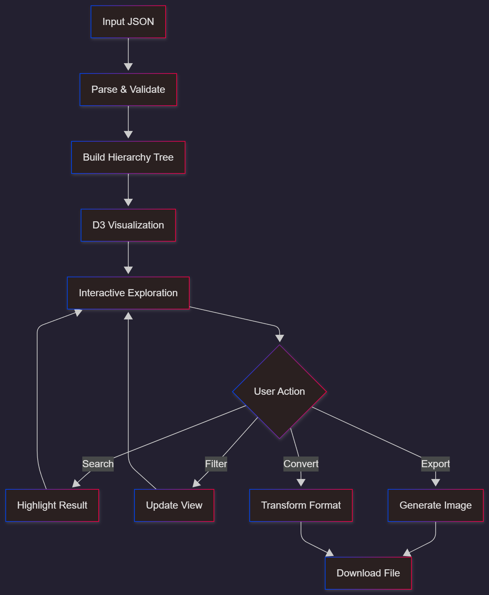
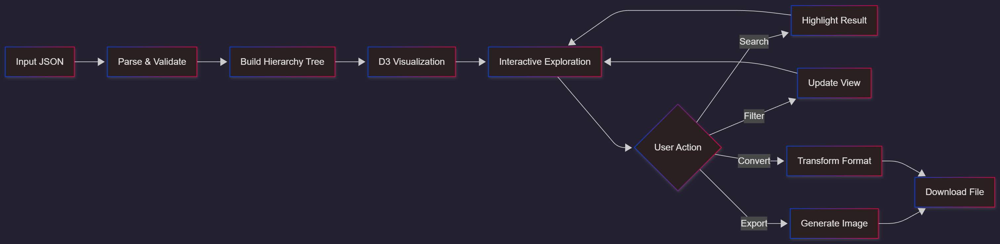

# 📊 JSONGlance

A powerful, interactive JSON visualization and manipulation tool built with React and D3.js.

---

## 🌟 Overview

**JSONGlance** is a free, secure, and feature-rich web application designed for developers and data analysts to visualize, analyze, and manipulate JSON data effortlessly. Built with modern web technologies, it offers an intuitive interface with powerful features that simplify working with complex JSON structures.

---

## ✨ Key Features

- 🎨 **Interactive Tree Visualization** — D3.js-powered hierarchical tree view with zoom and pan
- 🔍 **Smart Search** — Quickly find keys and values within your JSON structure
- 🎯 **Node Filtering** — Show/hide specific fields for cleaner visualization
- 📊 **Analytics Dashboard** — Real-time statistics including node count, depth, and type breakdown
- 🔄 **Format Conversion** — Convert between JSON, YAML, XML, and CSV formats
- 📥 **Export Options** — Export visualizations as PNG, JPG, SVG, or GIF images
- 🗺️ **Minimap Overview** — Navigate large JSON trees with ease
- 🎨 **Theme Support** — Switch between dark and light modes
- 🔍 **Search & Replace** — Deep search and replace values across entire JSON structure
- 🔒 **Privacy-First** — All processing happens client-side; your data never leaves your browser
- 💾 **Collapsible Nodes** — Auto-collapse large arrays and objects for better performance

---

## 🚀 Live Demo

**[Visit JSONGlance →](#)**  
_Add your deployed project URL above_

---

## 🏗️ Architecture

### Technology Stack

- **Frontend Framework:** React 18+
- **Build Tool:** Vite 5+
- **Visualization:** D3.js v7
- **Routing:** React Router v6
- **Styling:** Tailwind CSS + Inline Styles

### Format Conversion Libraries

- YAML: js-yaml
- XML: xml-js
- CSV: papaparse

---

## 📁 Project Structure

---

## 🔧 Installation & Setup

### Prerequisites

- Node.js (v16 or higher)
- npm or yarn

### Local Development

1. **Clone the repository**

 - git clone https://github.com/Hunter69240/JsonGlance.git
cd JsonGlance

2. **Install dependencies**

- npm install

3. **Set up environment variables**

- cp .env.example .env

Edit `.env` and add your configuration:

VITE_FORMSPREE_ENDPOINT=https://formspree.io/f/YOUR_FORM_ID
VITE_GITHUB_URL=https://github.com/YOUR_USERNAME

4. **Start development server**

_The application will be available at `http://localhost:5173`_

5. **Build for production**

6. **Preview production build**

npm run preview

---

## 📖 How It Works

### Workflow

### Core Functionality

#### 1. **JSON Parsing & Visualization**
- Input JSON is parsed and validated
- Hierarchical tree structure is built using D3.js
- Nodes are rendered with configurable spacing and styling
- Large arrays/objects are automatically collapsed (threshold: 5 items)

#### 2. **Search & Navigation**
- **Search:** Breadth-first search to find keys
- **Highlighting:** Selected nodes and ancestors visually highlighted
- **Exclusive Selection:** Searching clears selection; clicking nodes clears search
- **Minimap:** Provides overview with viewport rectangle

#### 3. **Analytics Engine**
- **Node Counting**
- **Depth Calculation**
- **Type Analysis**
- **Key Frequency**

#### 4. **Format Conversion**
Supported: JSON, YAML, XML, CSV (see libraries above)

#### 5. **Image Export**
- Clone SVG visualization
- Export as PNG, JPG, SVG, GIF

---

## 🔒 Security & Privacy

- ✅ **Client-Side Processing:** All data stays in your browser
- ✅ **No Server Communication:** JSON is never uploaded anywhere
- ✅ **Environment Variables:** Sensitive configs externalized
- ✅ **Git-Ignored Secrets:** `.env` excluded from version control

---

## 📦 Dependencies

### Core
- react
- react-dom
- react-router-dom
- d3

### Utilities
- js-yaml
- xml-js
- papaparse

### Development
- vite
- @vitejs/plugin-react
- eslint

---

## 🤝 Contributing

Contributions are welcome! Please follow these steps:

1. Fork the repository
2. Create a feature branch (`git checkout -b feature/AmazingFeature`)
3. Commit your changes (`git commit -m 'Add some AmazingFeature'`)
4. Push to the branch (`git push origin feature/AmazingFeature`)
5. Open a Pull Request

---

## 🐛 Bug Reports & Feature Requests

Found a bug or have an idea? Please [open an issue](https://github.com/Hunter69240/JsonGlance/issues) on GitHub.

---

## 📝 License

This project is licensed under the MIT License — see [LICENSE](LICENSE) for details.

---

## 🙏 Acknowledgments

- [D3.js](https://d3js.org/) — Powerful data visualization library
- [React](https://reactjs.org/) — UI framework
- [Vite](https://vitejs.dev/) — Build tool
- [Tailwind CSS](https://tailwindcss.com/) — CSS framework

---

## 📞 Contact & Support

- **Repository:** [github.com/Hunter69240/JsonGlance](https://github.com/Hunter69240/JsonGlance)
- **Issues:** [Report bugs or request features](https://github.com/Hunter69240/JsonGlance/issues)

- **Developer:** [@Hunter69240](https://github.com/Hunter69240)

---

**Made with ❤️ by Hunter69240**

If you find this project useful, please consider giving it a ⭐ on GitHub!

[⬆ Back to Top](#-jsonglance)

